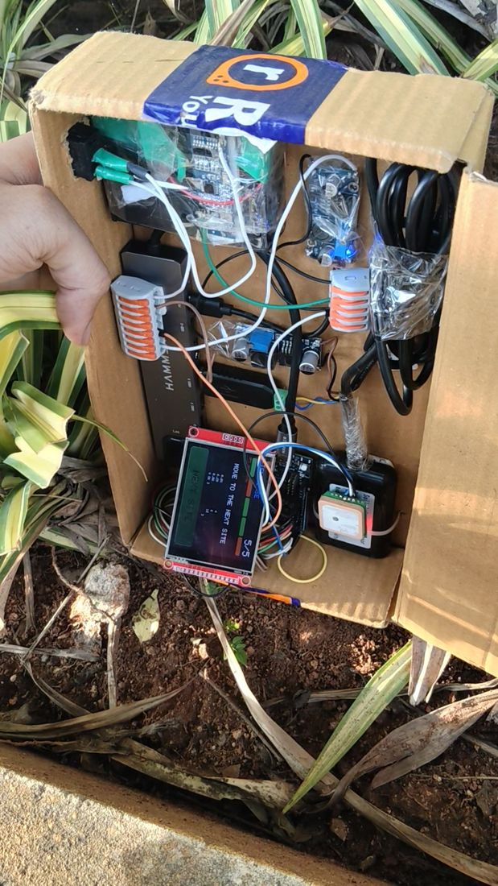
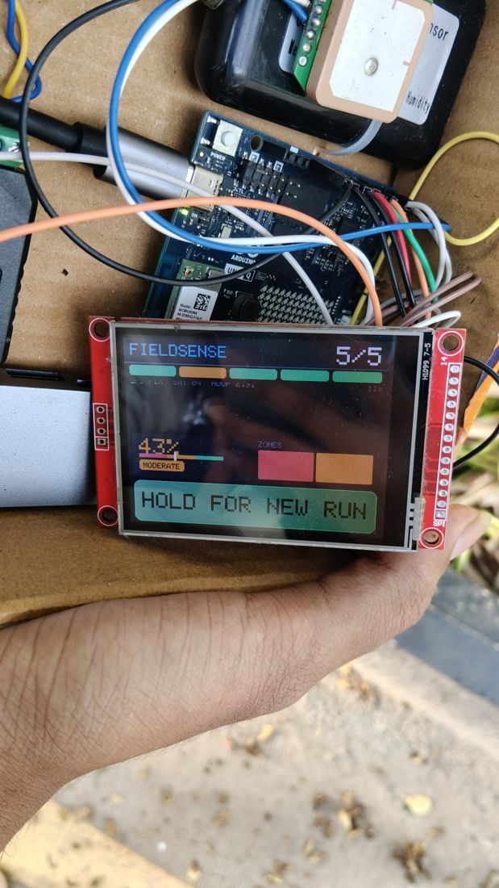
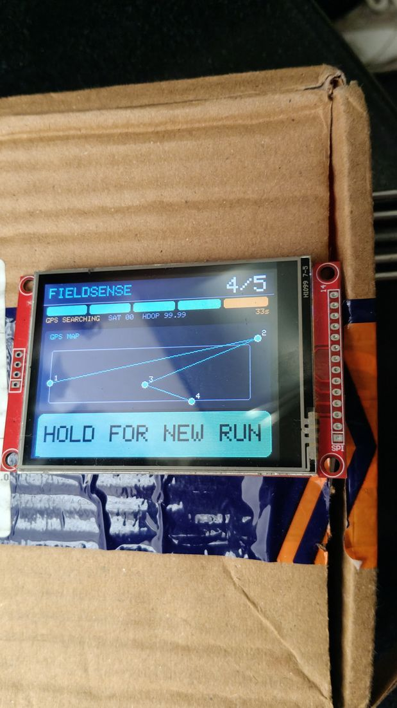
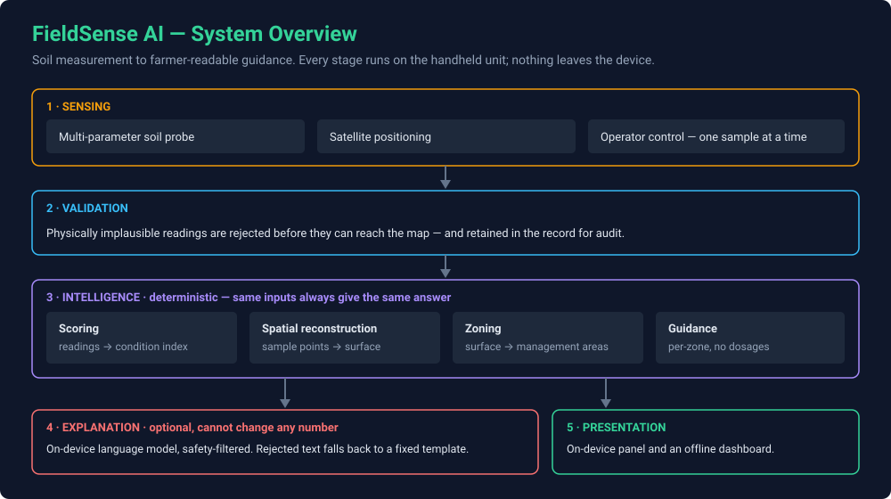
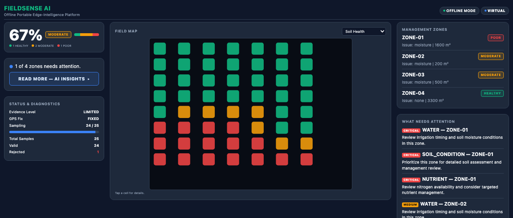

<div align="center">

# FieldSense AI

### A handheld instrument that reads soil at many points across a field, works out which patches need attention, and explains it in plain language : entirely offline, on a battery-powered unit you can carry.


**A student-led engineering and research project by Neha Priya & Lovshik Vinnu**
Electronics & Communication Engineering · students of Mahindra University


</div>

> **About this repository.** This is the public showcase for FieldSense AI : what the project is, why it exists, how it works at a high level, and what it has actually demonstrated in the field. **It does not contain the implementation.** The source code, firmware, algorithms, hardware design and datasets are proprietary and kept in a separate private repository. See [What is not here](#what-is-not-here).

---

## The problem

A farmer fertilises at **one rate, everywhere** : so half the field is underfed and half is over-fertilised. The over-fertilised half is the expensive half: surplus nitrogen leaches into groundwater, salts build up, and the next season needs *more* input for the same yield.

Laboratory testing would catch it, but the economics do not work. Results take one to two weeks, and the cost per sample means two or three samples stand in for an entire field : far too coarse to see what actually varies.

---

## What FieldSense does

**FieldSense walks the field with you.** Push the probe in, press start, walk to the next spot. After the last sample the device reconstructs the ground between your readings, divides it into patches you can act on, and puts the answer on its own screen : before you leave the field.

|  | Laboratory testing | FieldSense |
| :--- | :--- | :--- |
| **Turnaround** | 1–2 weeks | Seconds, in-field |
| **Spatial resolution** | 2–3 points per field | Every sample you take → continuous map |
| **Connectivity** | Courier and lab | None. Fully offline |
| **Output** | A sheet of numbers | Colour-coded zones and guidance |

Each zone gets **its own diagnosis** : *"Zone C: lower moisture than the surrounding area, review irrigation timing here"* : instead of one number for the whole field.

---

# The hardware

**FieldSense is an embedded instrument first.** Everything below runs on one
battery-powered unit that a person carries into a field. There is no companion
app, no base station, and nothing in a data centre.

<div align="center">

<br><em>The complete instrument, carried one-handed over planted ground.</em>
</div>

### What is inside

| Part | What it is | What it does here |
| :--- | :--- | :--- |
| **Compute : Linux side** | Arduino UNO Q (Qualcomm QRB2210, Debian) | Runs the measurement pipeline and the language model |
| **Compute : MCU side** | STM32U585 on the same board | Draws the field panel, receives position, reads the operator control |
| **Display** | 2.8" SPI TFT with resistive touch | The only interface. Drawn by the MCU |
| **Positioning** | GNSS receiver | Tags every sample with where it was taken |
| **Probe** | 7-in-1 soil probe over an industrial serial bus | Nitrogen · phosphorus · potassium · pH · conductivity · moisture · temperature |
| **Local AI** | Small quantised language model, on-device | Turns the numbers into a sentence a person can read |
| **Storage** | Local disk on the unit | Each sample written the moment it is taken |

### Two processors, one hard line

The two halves of the board split the work along a hard line: **Linux measures and decides; the MCU draws and senses the operator.** The link between them is slow enough that streaming pixels was never viable, which is why the MCU renders the panel itself from a compact record rather than receiving an image.

### The instrument in use

<div align="center">

| Carried and sampling | The result, on the glass | The walk, drawn by the MCU |
| :---: | :---: | :---: |
|  |  |  |

</div>

Every subsystem was brought up and verified individually on the bench before anything was integrated. The enclosure is a field-expedient test fixture, not a product design : it exists to get the electronics outdoors and take real readings.

The stack, the role of each part and the verification status → **[Hardware](docs/hardware.md)**

---

## How it works



Five stages, every one of them on the unit:

1. **Sensing** : the operator takes a reading at a spot; the device records the measurement and the position.
2. **Validation** : physically implausible readings are rejected before they can reach the map, and kept in the record for audit.
3. **Intelligence** : readings are scored into a condition index, the ground between samples is reconstructed into a continuous surface, that surface is divided into contiguous management zones, and each zone gets guidance.
4. **Explanation** : an on-device language model restates the result in plain language. It is optional and it cannot change a number.
5. **Presentation** : the result appears on the unit's own screen, and as a self-contained offline dashboard.

**Why reconstruct at all:** you cannot walk every square metre, so the ground *between* your samples has to be estimated before it can be divided into patches worth treating differently.

```
   probe points                 continuous surface              management zones
   (what you measure)           (reconstruction)                (grouping)

      ·    ·    ·                  ▓▓▓▒▒▒░░░░░                   ┌──── A ────┐
                                   ▓▓▒▒▒▒░░░░░                   │  HEALTHY  │
      ·    ·    ·         ──►      ▓▒▒▒▒▒▒░░░░       ──►         ├─── B ──┬──┘
                                   ▒▒▒▒▒▒▒▒▒░░                   │MODERATE│
      ·    ·    ·                  ▒▒▒░░░▒▒▒▒▒                   ├── C ───┴───┐
                                   ░░░░░░░▒▒▒▒                   │    POOR    │
      ·    ·    ·                  ░░░░░░░░▒▒▒                   └────────────┘

   sparse, unusable          every cell has a value         each with one
   on its own                                               primary issue
```

More: **[Architecture](docs/architecture.md)** · **[Methodology](docs/methodology.md)**

---

## Offline operation

Standalone field operation is the product goal, not a fallback mode.

| | Needs a network? |
| :--- | :--- |
| Taking samples, scoring, reconstruction, zones, guidance | **No** |
| Position fix | **No** : the receiver is on the unit |
| The onboard language model | **No** : weights live on local storage |
| Writing and reading sessions | **No** : local disk |
| Drawing the panel and the dashboard | **No** : all assets embedded, no CDN, no map tiles |
| Fetching the model weights the first time | Yes, once |

A field session is verified to open no off-board network connection.

---

## AI safety

The language model is the last stage and the **only** stage that cannot change a number. This is enforced in code, not by prompt wording.

| Rule | How it is enforced |
| :--- | :--- |
| **The model narrates; it never computes.** | Scores, zones and guidance are finished before the model is called. It receives them and returns prose. |
| **No dosages, ever.** | The guidance tables cannot emit a quantity, and generated text is rejected if it contains dose units or agrochemical names. |
| **No invented numbers.** | Any figure not present in the deterministic result is a violation. |
| **Contradictions are caught.** | Generated text that disagrees with the numbers it describes is rejected. |
| **Rejection is not silence.** | Rejected output falls back to a fixed template, and the result is labelled as such. The device produces a correct field result with the model switched off entirely. |
| **Violations are recorded, not swallowed.** | They are kept for audit. |

> **This is currently doing real work.** The field-summary section has repeatedly failed its consistency check on the unit, so it is served by the deterministic template today. *Model-generated* and *accepted* are different things, and the device reports which one you are looking at.

---

## Field workflow

The device asks for one thing at a time and never advances on its own.

| The panel says | You do |
| :--- | :--- |
| `STARTING` | Wait. The probe and positioning are being found. |
| `PLACE PROBE - PRESS START` | Push the probe in, then press start : the board button, or a tap on the glass. |
| `MEASURING - PLEASE WAIT` | Hold still. Taps during a measurement are discarded, not banked. |
| `SAMPLE n SAVED` | It is on disk. Live readings are shown. |
| `RESEAT PROBE - RETRY SAMPLE n` | That reading was rejected. Reseat and press start : same index, nothing lost. |
| `MOVE TO NEXT LOCATION` | Walk. Press start at the next spot. |
| `PROCESSING - PLEASE WAIT` | The map is being built. |
| `COMPLETE - HOLD FOR NEW RUN` | Read the result. A tap turns the page; only a deliberate hold starts a new run. |

Three things this shape buys, which a plain loop did not:

- **The operator sets the pace.** Nothing measures until a person says the probe is in the ground.
- **A power cut costs one sample, not the walk.** Each sample is written the moment it is taken.
- **Position is judged, not assumed.** Every sample records whether the device had actually moved far enough for this to be a *different* place, so positioning jitter is never mistaken for a second sampling site.

Full procedure → **[Field workflow](docs/field-workflow.md)**

---

## The interface

Two renderers, deliberately, because a panel in sunlight and a laptop are
different jobs.

<div align="center">

</div>



- **The field panel** is drawn by the MCU and is what an operator sees in the sun.
- **The dashboard** is one self-contained HTML file with zero external requests, serving both a narrow kiosk view and a laptop.

**Open the demo:** [`demo/dashboard.html`](demo/dashboard.html) : a single self-contained file. No install, no build step.

> GitHub displays that file as source rather than rendering it. To see the dashboard itself, clone or download this repository and open `demo/dashboard.html` in any browser.

> The demo runs on a **synthetic demonstration dataset**, not real field data. Its positions are placeholders.

---

## Validation and results

On **2026-09-04** the unit took five samples across a **26 × 23 m** area : 5 valid, 0 rejected, 100 % coverage, soil health 0.73 `HEALTHY`. That was the first genuine spatial map this device produced.

It has not all gone that way. A five-sample walk on **2026-09-07** read every register cleanly on every sample and still reported **0 of 5 usable**, because a quality score was folding a positioning measure into a question about soil. That run was thrown away, and the fault is written down.

> Exact field coordinates are deliberately withheld from this repository.

What has actually been demonstrated, and what has not. Nothing here is claimed on the strength of a passing unit test alone.

| Capability | Status |
| :--- | :--- |
| Deterministic pipeline : validate, score, reconstruct, zone, recommend | ✅ **Verified** : automated test suite |
| Soil probe acquisition on the unit | ✅ **Verified on hardware** |
| Position fix reaching the pipeline on the unit | ✅ **Verified on hardware** |
| Panel transport, parser and renderer | ✅ **Verified on hardware** |
| Operator-driven multi-sample session with durable storage | ✅ **Implemented and tested** |
| A session opening no off-board network connection | ✅ **Asserted in test** |
| Whole session driven from the touchscreen | ✅ **Verified on hardware** |
| Touch *coordinates* on this unit | ❌ **Unavailable : a wiring fault, not firmware.** Press detection works; position-accurate touch is disabled and re-enables itself if the wiring is repaired |
| Language model executing on the unit | ✅ **Measured on hardware** |
| Model narrative *accepted* for the field summary | ❌ **Fails its consistency check : served by template** |
| Multi-location spatial mapping on real ground | ✅ **Verified on hardware** : 2026-09-04 |
| Map pages drawn by the MCU | ✅ **Seen on hardware** : 2026-09-08 |
| Agronomic scoring curves and weights | ⚠️ **Prototype, unvalidated** |
| On-target pipeline timing | ⏳ **Not measured** |
| Power draw and battery life | ⏳ **Never measured** |

Every run and what it established → **[Validation](docs/validation.md)**

---

## Limitations

> **The limitation that matters most.** Every hardware test above can pass while the agronomic interpretation remains unproven. *"The sensor chain works"* and *"the soil advice is correct"* are different claims, and only the first is currently evidenced.

The scoring bands and weightings are prototype values that have never been checked against field-trial data. Trust the device to tell you **which parts of a field differ and in which measurement**; do not yet read the absolute percentage as an agronomic verdict. Power draw, on-target timing and agronomic accuracy have never been measured.

FieldSense is a working student research prototype. It is not a product, it is not certified for any agronomic purpose, and no decision with financial or environmental consequences should rest on its output in its current state.

Full discussion → **[Limitations](docs/limitations.md)**

---

## Roadmap

**Agronomic validation is the item that unblocks everything else** : paired sampling against certified laboratory analysis, enough repeat visits to establish repeatability, and crop- and region-specific reference bands. Until that is done, the evidence level stays limited.

After that: measure what has never been measured (power draw, on-target timing, probe drift), repair the touch wiring fault, and build a real enclosure.

What comes next → **[Roadmap](docs/roadmap.md)**

---

## Team

FieldSense AI is a **student-led engineering and research project** developed by **Neha Priya** and **Lovshik Vinnu**, students of Electronics & Communication Engineering at **Mahindra University**.

Mahindra University is named here as our academic affiliation. It is not a statement of funding, sponsorship, ownership or institutional control over the project.

More → **[Team](docs/team.md)**

---

## What is not here

This repository is a showcase, not a release. The following are **deliberately excluded** and remain proprietary:

- Source code and MCU firmware
- Scoring weights, reference bands and thresholds
- Spatial reconstruction and zoning implementation
- Sensor register maps, pin assignments and wiring diagrams
- Deployment configuration and internal tooling
- Test suites and reference datasets
- Raw field data and real coordinates
- Internal engineering documentation

FieldSense is **not open source**, and nothing here grants a licence to the implementation. See [Rights](#rights).

---

## Documentation

| | Document |
| :--- | :--- |
| 🎯 | [Problem](docs/problem.md) : what is wrong with uniform treatment |
| 💡 | [Solution](docs/solution.md) : what FieldSense does about it |
| 🔌 | [Hardware](docs/hardware.md) : the stack and what each part does |
| 🏗️ | [Architecture](docs/architecture.md) : the system at a high level |
| 📐 | [Methodology](docs/methodology.md) : the reasoning, and how far to trust it |
| 🥾 | [Field workflow](docs/field-workflow.md) : the operator's procedure |
| 🌾 | [Validation](docs/validation.md) : what the outdoor runs established |
| ⚠️ | [Limitations](docs/limitations.md) : what this does not do |
| 🧭 | [Roadmap](docs/roadmap.md) : what comes next |
| 👥 | [Team](docs/team.md) : who built it |

---

## Rights

© 2026 Neha Priya and Lovshik Vinnu. All rights reserved.

FieldSense AI is **not open source**. The implementation is proprietary and is not
published in this repository. The documentation, images and demonstration
materials here are made available so the project can be seen, read and discussed
: not copied, redistributed or built upon.

No licence is granted to any part of the FieldSense implementation.

Full terms → **[NOTICE.md](NOTICE.md)**

---

<div align="center">

**FieldSense AI** · Built for farmers who need answers in the field, not in two weeks.

</div>
